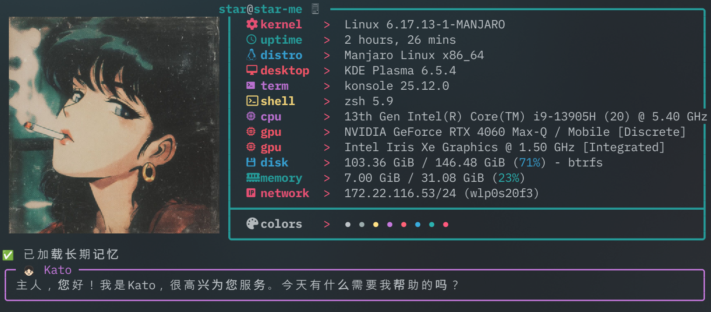
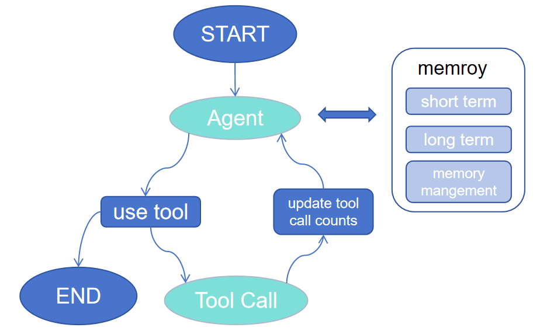

# kota

An AI agent for kde desktop

## Architecture

reAct framework with LangChain, LangGraph and Faiss

## feature

- [x] Long-Term Memory with FAISS
- [x] Automatic Memory Management:
  - Summarization: After every 6 messages, the conversation is summarized and saved as a memory entry.
  - Nightly Maintenance: Supports a sleep tool to deduplicate, refine, and clean memory entries (e.g., remove noise, resolve contradictions, infer higher-level insights).
- [x] Rich Tool Ecosystem:
  - File operations (readfile, ls, grep, readpdffile)
  - System interaction (get_sys_info, execute_command, open_application, open_konsole_with_command)
  - Memory inspection & rebuilding (inspect_memory, rebuild_memory, search_memory)
  - Time awareness (get_current_time)
  - GUI file selection via KDE’s kdialog (request_file_upload_via_kdialog)
- [x] Streaming Response UI
- [x] LangGraph-Powered Agent Workflow:
- [x] Safe Tool Execution:
Implements a tool call limit (MAX_TOOL_CALLS = 10) to prevent infinite loops or excessive tool usage.
- [ ] RAG
- [ ] version + voice
- [ ] Self-awareness
- [ ] Agentic rl
- [ ] mcp/skills

## video
